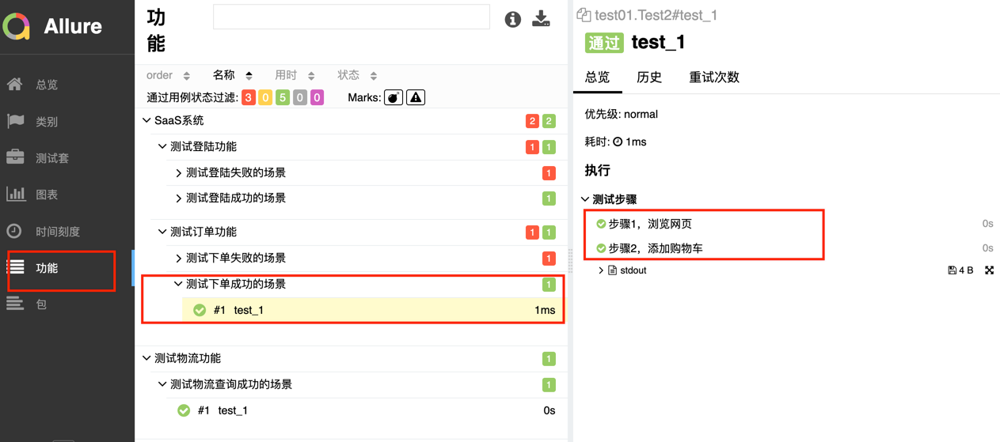
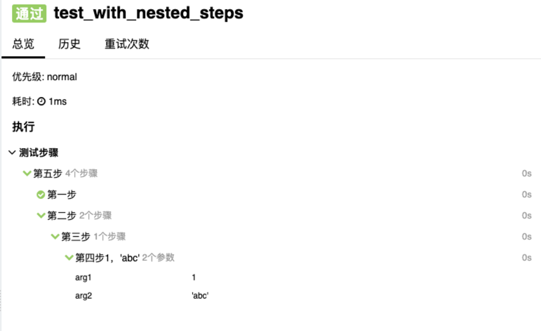
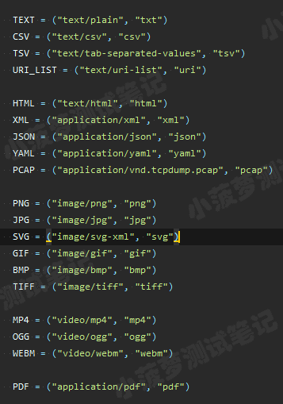
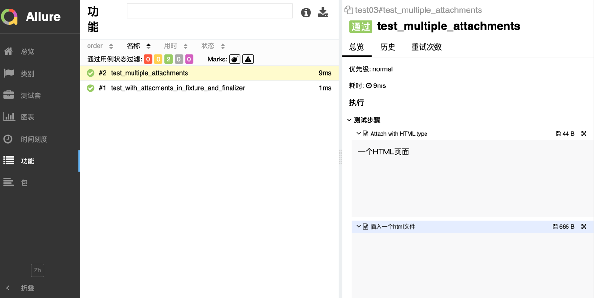
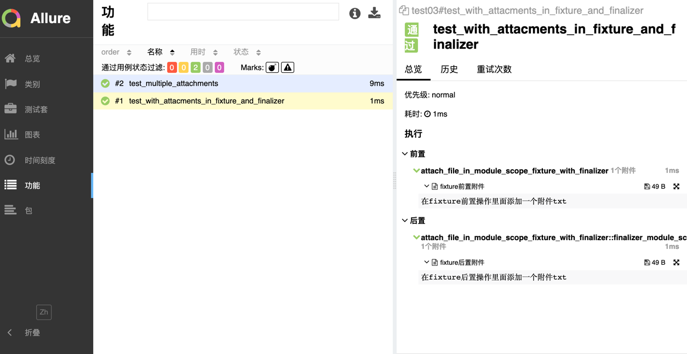
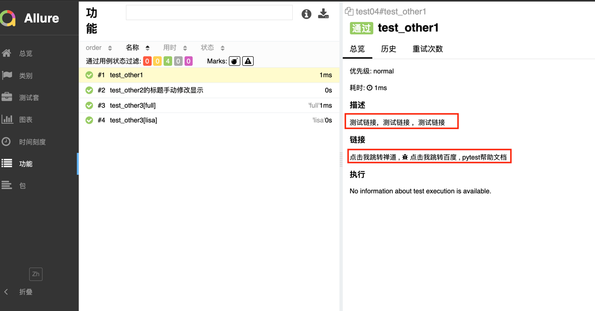
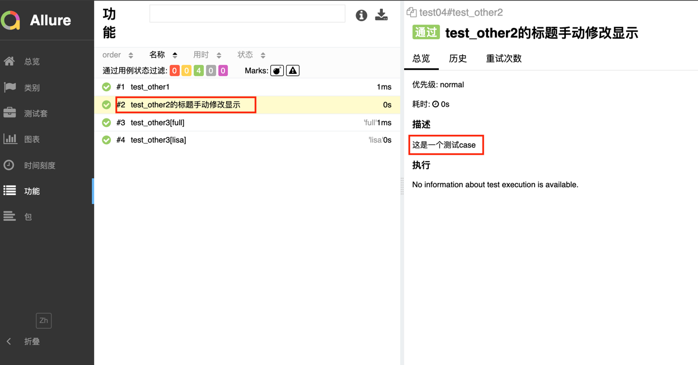
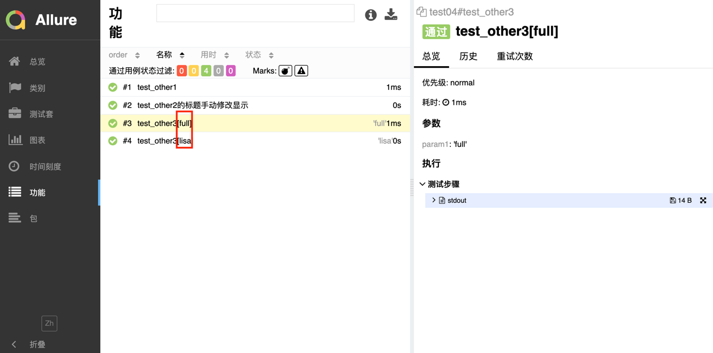

## 生成allure测试结果json文件

```shell
pytest test01.py --alluredir=report    # 生成的json文件保存的文件夹,基于pytest捕捉到的测试用例，每个用例的执行结果会生成一个json文件
pytest --alluredir report test01.py    # 和上面的语句效果一样
```

## 生成最终的测试报告
```shell
allure generate report  # 将 report 文件夹下的json文件渲染成网页结果，方便观看。生成的网页结果默认保存在当前文件夹下的 allure-report 文件夹内。
allure generate report -o html --clean  # -0指定报告生成路径，–clean 先清空测试报告目录，再生成新的测试报告
```

## 查看测试报告

```shell
allure open allure-report   # 本地渲染allure generate生成的allure-report文件夹，并且自动打开浏览器展示
allure serve allure-report # 本地渲染后对外展示结果
```

## severity 对测试用例分级别
> Blocker级别：中断缺陷（客户端程序无相应，无法执行下一步操作）
> 
> Critical级别：临界缺陷（功能点缺失）
> 
> Normal级别：普通缺陷（数值计算错误）
> 
> Minor级别：次要缺陷（界面错误与UI需求不符）
> 
> Trivial级别：轻微缺陷（必要项无提示，或者提示不规范）
### 示例代码
```python
import allure

class Test4:
    @allure.severity("minor")
    def test_1(self):
        assert 1 == 1

    @allure.severity("critical")
    def test_2(self):
        assert 1 == 2

    @allure.severity("normal")
    def test_3(self):
        assert 3 == 3
```
```shell
pytest --alluredir=report/xml --allure-severities=minor  test01.py  # 此时仅执行test_1测试用例
# 选项--allure-severities=minor 主要用来指定执行那些级别的用例
# 类似与pytest的 -m选项，把测试用例进行分组分组

# 同样可以根据feature，story运行指定的测试用例
pytest --alluredir=report/xml --allure_features=测试登陆功能 test_demo2.py
pytest --alluredir=report/xml --allure_stories=测试登陆成功的场景 test_demo2.py
```


## allure装饰器
> epic 敏捷里的概念，定义诗篇
> 
> fetature 相当于一个功能，一个大的模块
> 
> story 相当于对应这个功能或者模块的不同场景，即子功能点；
> 
> feature和story类似父子关系
> 
> with allure.step # 用于将一个测试用例，分成几个步骤在报告中输出

### 示例代码

```python
import allure

@allure.epic('SaaS系统')
@allure.feature("测试登陆功能")
class Test1:
    @allure.story('测试登陆成功的场景')
    def test_1(self):
        assert 1 == 1

    @allure.story("测试登陆失败的场景")
    def test_2(self):
        assert 1 == 2


@allure.epic('SaaS系统')
@allure.feature("测试订单功能")
class Test2:
    @allure.story('测试下单成功的场景')
    def test_1(self):
        with allure.step('步骤1，浏览网页'):
            print(1)
        with allure.step('步骤2，添加购物车'):
            print(2)
        assert 1 == 1

    @allure.story("测试下单失败的场景")
    def test_2(self):
        assert 1 == 2


@allure.feature("测试物流功能")
class Test3:
    @allure.story('测试物流查询成功的场景')
    def test_1(self):
        assert 1 == 1
```
#### 报告结果


> @allure.step() 装饰器，可以让测试用例在allure报告中显示更详细的测试过程
### 示例代码
```python
import allure

@allure.step("第一步")
def passing_step():
    pass


@allure.step("第二步")
def step_with_nested_steps():
    nested_step()

@allure.step("第三步")
def nested_step():
    nested_step_with_arguments(1, 'abc')


@allure.step("第四步{0}，{arg2}")
def nested_step_with_arguments(arg1, arg2):
    pass


@allure.step("第五步")
def test_with_nested_steps():
    passing_step()
    step_with_nested_steps()
```
#### 报告结果


> allure.attach 作用：allure报告还支持显示许多不同类型的附件，可以补充测试结果；自己想输出啥就输出啥
> 
> 语法：allure.attach(body, name, attachment_type, extension)
> 
> 参数列表：
> 
> body：要显示的内容（附件）
> 
> name：附件名字
> 
> attachment_type：附件类型，是 allure.attachment_type 里面的其中一种
> 
> extension：附件的扩展名（比较少用）
> 
> allure.attach.file(source, name, attachment_type, extension)
> 
> source：文件路径，相当于传一个文件，其他和上面一致
> 
> attachment_type类型
> 
> 
#### 示例代码
```python
import pytest
import allure


@pytest.fixture
def attach_file_in_module_scope_fixture_with_finalizer(request):
    allure.attach('在fixture前置操作里面添加一个附件txt', 'fixture前置附件', allure.attachment_type.TEXT)

    def finalizer_module_scope_fixture():
        allure.attach('在fixture后置操作里面添加一个附件txt', 'fixture后置附件', allure.attachment_type.TEXT)

    request.addfinalizer(finalizer_module_scope_fixture)


def test_with_attacments_in_fixture_and_finalizer(attach_file_in_module_scope_fixture_with_finalizer):
    pass


def test_multiple_attachments():
    allure.attach('<head></head><body> 一个HTML页面 </body>', 'Attach with HTML type', allure.attachment_type.HTML)
    allure.attach.file('./report/index.html', '插入一个html文件', attachment_type=allure.attachment_type.HTML)
```
#### 报告结果



> allure.title() 自定义用例标题，标题默认为函数名.
> 
> allure.description 提供描述字符串的装饰器，描述默认为函数说明
> 
> allure.description_html 提供一些HTML在测试用例的描述部分  (待研究)
> 
> 将case所需参数展示在报告中，方便问题追踪
> 
#### 示例代码
```python
import allure
import pytest


# 链接测试
@allure.link('https://docs.pytest.org/en/latest',name='pytest帮助文档')
@allure.issue('http://baidu.com', name='点击我跳转百度')
@allure.testcase('http://bug.com/user-login-Lw==.html', name='点击我跳转禅道')
def test_other1():
    """测试链接，测试链接 ，测试链接"""
    pass


@allure.description('这是一个测试case')
@allure.title('test_other2的标题手动修改显示')
def test_other2():
    """测试链接，测试链接 ，测试链接"""
    pass


@pytest.mark.parametrize('param1', ['full', 'lisa'])
def test_other3(param1):
    print('param1 = ' + param1)
    pass
```


